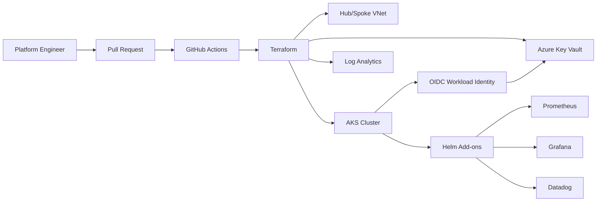

# Platform Architecture

## Design rationale

The platform keeps environment composition separate from reusable modules. That reduces copy/paste drift and gives production changes a predictable promotion path.

Identity uses OIDC/workload identity so workloads do not need embedded cloud credentials. Observability is provisioned as a platform concern, while Helm add-ons remain independently upgradeable.

For production, the network layer should be extended with private API access, egress controls, private DNS, firewall/NAT policy, and controlled administrative access.
